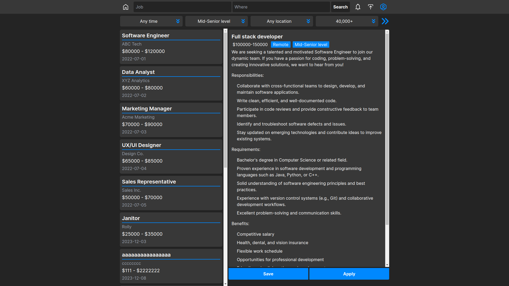

# Linked inspired job platform with bounties

## Features

-   Getting list of products
-   Write job posts and save them into db
-   Search jobs by category or title and with various filters
-   Clean responsive ui
-   User login

### WIP

-   User profile
-   Bounties

## Getting started

```
npm i
npm run dev
```

## Environment config

**Nextauth**

```
NEXTAUTH_SECRET=
GITHUB_ID=
GITHUB_SECRET=
GOOGLE_CLIENT_ID=
GOOGLE_CLIENT_SECRET=
```

**MongoDB**

```
MONGODB_USER=
MONGODB_PASSWORD=
```

## Tech stack

-   Next.js
-   Typescript
-   Tailwind
-   React query
-   Next-auth
-   Zustand
